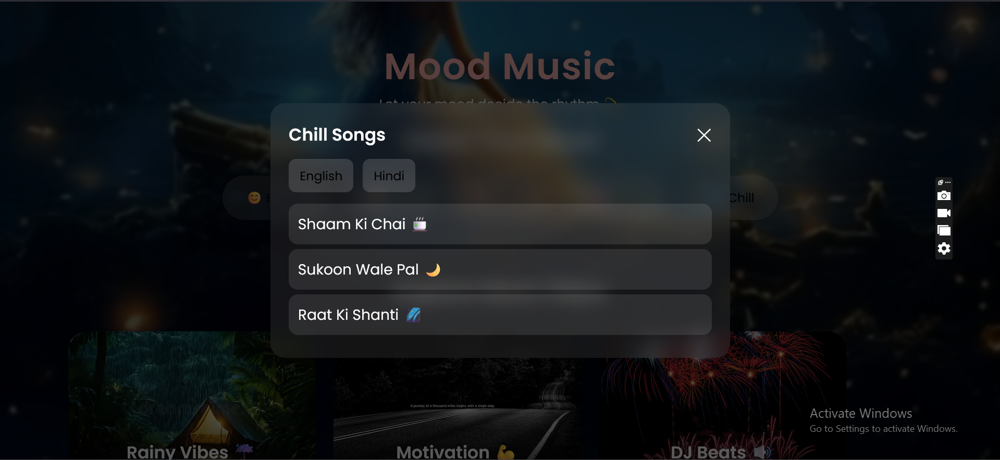
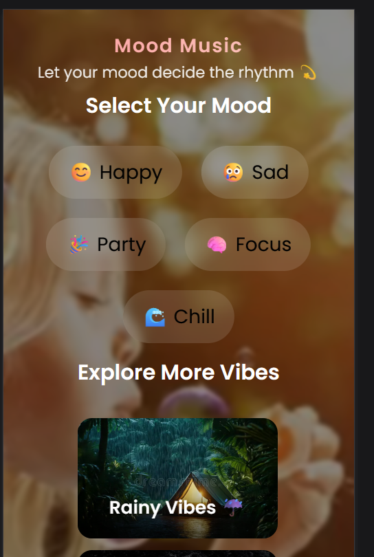

z 🎶 Mood Music Web App

An **interactive and responsive music website** that changes its **background video, theme, and song recommendations** based on the user's selected mood — such as **Happy, Sad, Party, Chill, or Focus**.

🌈 This project demonstrates my front-end skills using **HTML, CSS, and JavaScript**, focusing on dynamic DOM manipulation and UI/UX design.

---

## 🚀 Live Demo

🔗 **Check it out here:**(https://shaik-nazia-cse.github.io/mood-music-website/).

---

## 🧠 Features

✨ **Mood Detection:**  
Choose from moods like Happy, Sad, Party, Chill, and Focus — each changes the entire background video and color theme dynamically.

🎥 **Dynamic Video Backgrounds:**  
The background seamlessly updates to match your mood — giving you a personalized visual experience.

🎧 **Music Recommendations:**  
Each mood brings a curated YouTube music embed (or playlist) suited to the vibe.

💻 **Fully Responsive Design:**  
Built using HTML5 and CSS3, optimized for both desktop and mobile devices.

🎨 **Custom UI & Animation:**  
Smooth transitions and hover effects for an interactive user experience.

---

## 🛠️ Tech Stack

| Technology | Description |
|-------------|-------------|
| **HTML5** | Structure and layout |
| **CSS3** | Styling, transitions, and responsive design |
| **JavaScript (ES6)** | DOM manipulation and interactivity |
| **YouTube Embed API** | For playing mood-based music |
| **GitHub Pages** | Hosting and deployment |

---

## 📁 Folder Structure
mood-music-website/
├── index.html
├── style.css
├── script.js
│ ├── videos/
│ │ ├── happy.mp4
│ │ ├── sad.mp4
│ │ ├── chill.mp4
│ │ ├── focus.mp4
│ │ └── party.mp4
│ └── images/
│ ├── peaceful.jpg
│ ├── rainy.jpg
│ └── motivation.jpg
└── README.md

## 🧩 How It Works

1. User selects a **mood button**.
2. JavaScript event listener triggers:
   - Background video changes.
   - Theme color updates.
   - Embedded YouTube music changes.
3. The overall atmosphere updates instantly.

---

## 🧠 Learning Highlights

- DOM Manipulation  
- Event Handling in JavaScript  
- Responsive Web Design  
- Using Videos as Backgrounds  
- UI/UX Enhancement through CSS Transitions  

---

## 📸 Screenshots

| Home Page | Mood Selected |
|------------|---------------|
|  |  |

---

## 💬 Future Improvements

- Add automatic mood detection using webcam or emotion recognition APIs  
- Include Spotify integration  
- Save user preferences locally  
- Dark/light mode toggle  
---

## 🧑‍💻 Author

**Your Name**  
📫 [sknaziacse@gmail.com]  
💼 [LinkedIn Profile](https://www.linkedin.com/in/shaik-nazia-022744381/)

---

## ⭐ Support

If you like this project, don’t forget to ⭐ the repository and share it with your friends!
